# 设计模式 (Design Patterns)
> [爱编程的大丙-设计模式](https://subingwen.cn/design-patterns/#3-%E7%BB%93%E6%9E%84%E5%9E%8B%E6%A8%A1%E5%BC%8F)

## 设计模式三原则
* **单一职责原则** 对一个类而言，应该仅有一个引起它变化的原因，其实就是将这个类所承担的职责单一化，如果一个类承担的职责过多，就等于把这些职责耦合到了一起，一个职责的变化可能会削弱或者抑制这个类完成其他职责的能力。这种耦合会导致设计变得脆弱，当变化发生时，设计会遭受到意想不到的破坏。
* **开放-封闭原则** 软件实体（类、模块、函数等）可以扩展，但是不可以修改。也就是说对于扩展是开放的，对于修改是封闭的。该原则是程序设计的一种理想模式，在很多情况下无法做到完全的封闭。但是作为设计人员，应该能够对自己设计的模块在哪些位置产生何种变化了然于胸，因此需要在这些位置创建抽象类来隔离以后发生的这些同类变化（其实就是对多态的应用，创建新的子类并重写父类虚函数，用以更新处理动作）。
* **依赖倒转原则** 
  1. 高层模块不应该依赖低层模块，两个都应该依赖抽象。
  2. 抽象不应该依赖细节，细节应该依赖抽象。  
  其中：
  - 高层模块：可以理解为上层应用，就是业务层的实现
  - 低层模块：可以理解为底层接口，比如封装好的API、动态库等
  - 抽象：指的就是抽象类或者接口，在C++中没有接口，只有抽象类
---
## 单例模式
* **类的静态成员特性**
  - **作用范围** 静态成员在类的所有对象中是共享的，无论创建多少类的对象都只有一个成员副本
  - **初始化** 静态成员不能在类中初始化，只可以在类的外部通过作用域解析符“::”来重新声明静态变量从而对它进行初始化。如果不显示初始化静态成员变量，则在创建第一个对象时，所有的静态数据都会被初始化为零
  - **静态成员函数** 函数成员声明为静态，可以把函数与类的任何特定对象独立开来。静态成员函数即使在类对象不存在的情况下也能被调用，静态函数使用类名加作用域解析“::”访问
    - 静态成员函数只能访问静态成员数据、其他静态成员函数和类外部的其他函数
    - 静态成员函数有一个类范围，他们不能访问类的 this 指针。可以使用静态成员函数来判断类的某些对象是否已被创建
    - 静态成员函数没有 this 指针，只能访问静态成员（包括静态成员变量和静态成员函数）

* **禁止实例化对象**
  - 构造函数私有化
  - 拷贝构造函数私有化或者禁用（使用 = delete）
  - 拷贝赋值操作符重载函数私有化或者禁用（从单例的语义上讲这个函数已经毫无意义，所以在类中不再提供这样一个函数，故将它也一并处理一下）

* **饿汉模式**： 类加载时立刻实例化，不存在线程安全问题，一般情况下更推荐
```cpp
// 饿汉模式
class TaskQueue
{
public:
    TaskQueue(const TaskQueue& obj) = delete; // = delete 代表函数禁用, 也可以将其设置为private
    TaskQueue& operator=(const TaskQueue& obj) = delete;
    static TaskQueue* getInstance()
    {
        return m_taskQ;
    }
private:
    TaskQueue() = default; // 默认构造函数私有化
    static TaskQueue* m_taskQ;
};
// 静态成员初始化放到类外部处理
TaskQueue* TaskQueue::m_taskQ = new TaskQueue;

int main()
{
    TaskQueue* obj = TaskQueue::getInstance();
}
```

* **懒汉模式**：类加载时不实例化，第一次使用时实例化，存在线程安全问题（存在多个线程同时实例化的风险）
```cpp
// 懒汉模式
class TaskQueue
{
public:
    TaskQueue(const TaskQueue& obj) = delete;// = delete 代表函数禁用, 也可以将其设置为private
    TaskQueue& operator=(const TaskQueue& obj) = delete;
    static TaskQueue* getInstance()
    {
        if(m_taskQ == nullptr)
        {
            m_taskQ = new TaskQueue;
        }
        return m_taskQ;
    }
private:
    TaskQueue() = default;
    static TaskQueue* m_taskQ;
};
TaskQueue* TaskQueue::m_taskQ = nullptr;

int main()
{
    TaskQueue* obj = TaskQueue::getInstance();
}
```
---
## 工厂模式
* **实现多态的要点**
  - 父类中至少有一个虚函数
  - 子类重写父类的虚函数
  - 父类指针指向子类对象
  - 使用 new 动态创建对象
  - 使用 delete 释放对象
  
* **简单工厂模式(Simple Factory Pattern)**： 由一个工厂类根据传入的参数决定创建哪一种产品类的实例
  1. 创建产品基类，定义产品的公共接口
  2. 创建具体产品类，继承产品基类并实现其接口
  3. 创建工厂类，工厂类包含一个静态方法，根据传入的参数决定创建哪一种具体产品类的实例并返回给客户端
  4. 客户端通过调用工厂类的静态方法来获取产品对象，使用完毕后需要释放对象
  - **注意**：*简单工厂模式实际上违反了开放-封闭原则，因为当需要增加新的产品时，不得不修改工厂类的代码，适用于产品种类较少且不经常变化的场景*
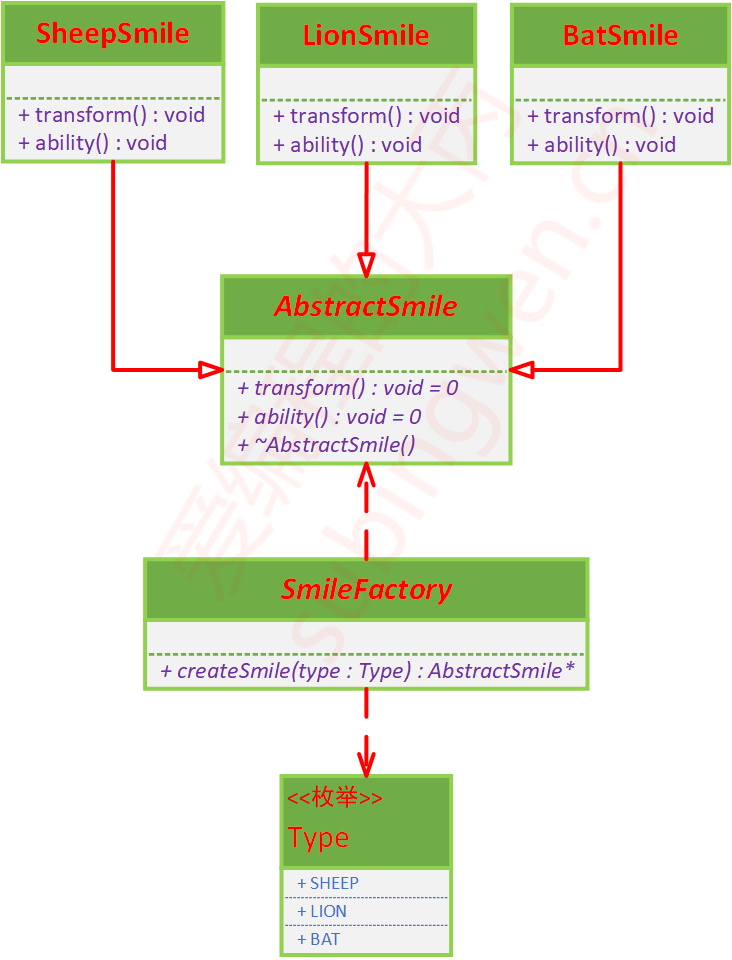
```cpp
// 产品基类
class Product
{
public:
    virtual void show() = 0;
    virtual ~Product() = default;
};
// 具体产品类A
class ProductA : public Product
{
public:
    void show() override
    {
        std::cout << "This is Product A" << std::endl;
    }
};
```
```cpp
// 具体产品类B
class ProductB : public Product
{
public:
    void show() override
    {
        std::cout << "This is Product B" << std::endl;
    }
};
```
```cpp
// 工厂类
class Factory
{
public:
  // 产品类型枚举(强枚举，使用char类型节省内存)
  enum class ProductType:char
  {
      PRODUCT_A,
      PRODUCT_B
  };
  static Product* createProduct(ProductType type)
  {
     Product* product = nullptr;
      switch(type)
      {
           case PRODUCT_A:
              product = new ProductA;
              break;
          case PRODUCT_B:
               product = new ProductB;
              break;
          default:
              break;
      }
      return product;
  }
};
```
```cpp
// 客户端代码
int main()
{
    Product* productA = Factory::createProduct(Factory::PRODUCT_A);
    productA->show();
    delete productA;

    Product* productB = Factory::createProduct(Factory::PRODUCT_B);
    productB->show();
    delete productB;
}
```

* **工厂方法模式(Factory Method Pattern)**： 定义一个用于创建对象的接口，让子类决定实例化哪一个类。工厂方法使一个类的实例化延迟到其子类
  1. 创建产品基类，定义产品的公共接口
  2. 创建具体产品类，继承产品基类并实现其接口
  3. 创建抽象工厂类，声明一个用于创建产品对象的纯虚函数
  4. 创建具体工厂类，继承抽象工厂类并实现其创建产品对象的纯虚函数
  5. 客户端通过具体工厂类来获取产品对象，使用完毕后需要释放对象
  - **注意**：*工厂方法模式符合开放-封闭原则，当需要增加新的产品时，只需增加具体产品类和对应的具体工厂类，而不需要修改已有的代码，适用于产品种类较多且经常变化的场景*
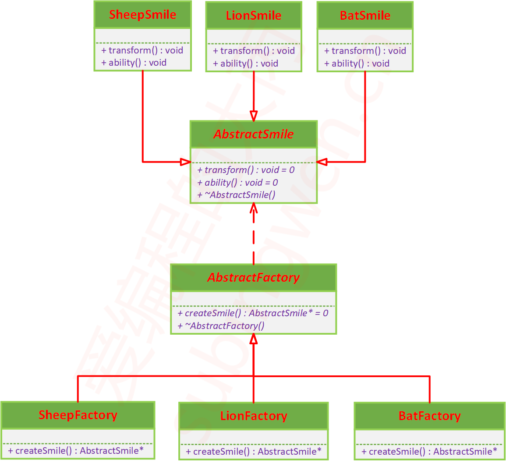
```cpp
// 抽象工厂类
class Factory
{
public:
    virtual Product* createProduct() = 0;
    virtual ~Factory() = default;
};
```
```cpp
// 具体工厂类A
class FactoryA : public Factory
{
public:
    Product* createProduct() override
    {
        return new ProductA;
    }
};
```
```cpp
// 具体工厂类B
class FactoryB : public Factory
{
public:
    Product* createProduct() override
    {
        return new ProductB;
    }
};
```
```cpp
// 客户端代码
int main()
{
    Factory* factoryA = new FactoryA;
    Product* productA = factoryA->createProduct();
    productA->show();
    delete productA;
    delete factoryA;

    Factory* factoryB = new FactoryB;
    Product* productB = factoryB->createProduct();
    productB->show();
    delete productB;
    delete factoryB;
}
```
---
## UML类图

* **类(Class)**： 上层是类名，中间层是属性（类的成员变量），下层是方法（类的成员函数）  
  - 可见性：+ 表示public、# 表示protected、- 表示private、__(下划线)表示static
  - 属性的表示方式：[可见性][属性名称]:[类型]= { 缺省值，可选 }
  - 方法的表示方式：[可见性][方法名称]([参数名 : 参数类型，……]):[返回值类型]<br>
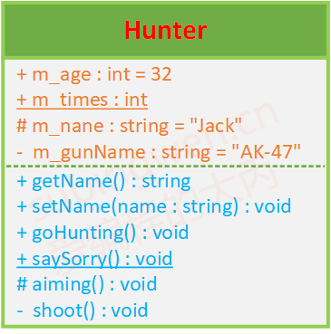  

* **抽象类(Abstract)**： 对于抽象类（类中有虚函数），类名使用***斜体***显示
  - 虚函数也使用斜体表示
  - 纯虚函数需要指定=0<br>
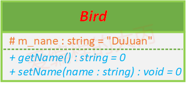 

* **继承关系(Generalization)**： 使用**带空心三角形箭头的实线指向父类**<br>
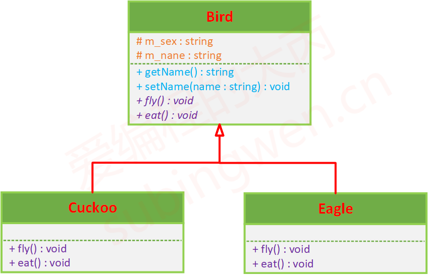

* **关联关系(Assocition)**： 一个类被另一个类包含（作为成员变量）
  - **单向关联**：使用带单向箭头的实线指向被包含的类<br>
  
  - **双向关联**：使用带双向箭头或不带箭头的实线指向被包含的类<br>
  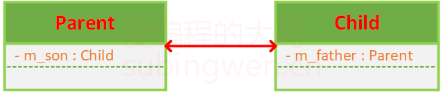
  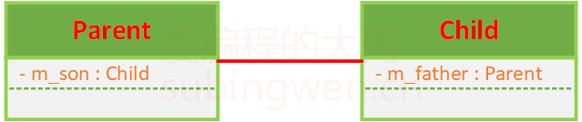
  - **自关联**：使用带单向箭头的实线指向自己<br>
  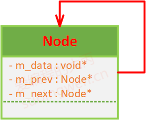

* **聚合关系(Aggregation)**： 表示**整体**与**部分**的关系，成员对象是整体的一部分，但是成员对象可以脱离整体对象独立存在（例如：Forest与Plant、Animal、Water、Sunshine）。聚合关系用**带空心菱形的直线**表示。<br>
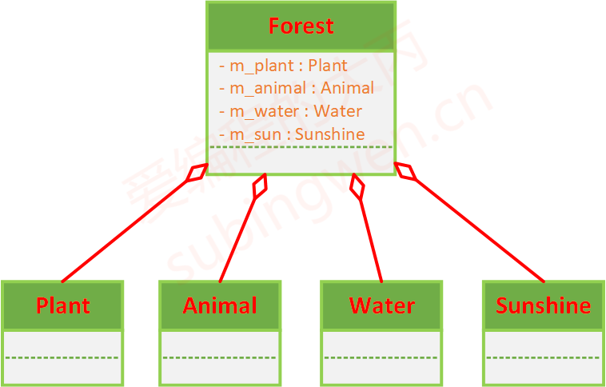

* **组合关系(Composition)**： 也表示**整体**与**部分**的关系，但组合关系中整体对象可以控制成员对象的生命周期，一旦整体对象不存在，成员对象也不存在，整体对象和成员对象之间具有同生共死的关系（例如：Tree和Root、Trunk、Branch、Leaf）。组合关系用**带实心菱形的直线**表示。<br>
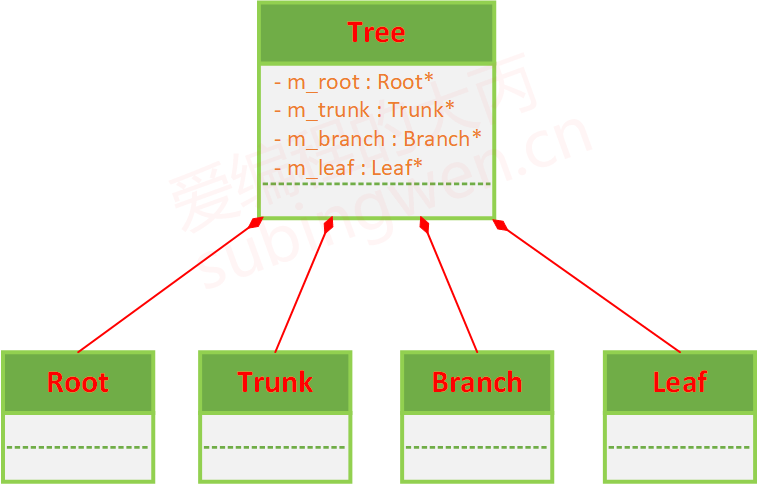

* **依赖关系(Dependency)**： 是一种使用关系，特定事物的改变有可能会影响到使用该事物的其他事物，在需要表示一个事物使用另一个事物时使用依赖关系，大多数情况下依赖关系体现在某个类的方法使用另一个类的对象作为参数（例如：树木（Tree）的生长，需要将空气（Air）、水（Water）、土壤（Soil）对象作为参数传递给 Tree 类的 grow（）方法）。依赖关系用**带箭头的虚线**表示，由依赖的一方指向被依赖的一方。依赖关系通常通过三种方式来实现：
  - 将一个类的对象作为另一个类中方法的参数
  - 在一个类的方法中将另一个类的对象作为其对象的局部变量
  - 在一个类的方法中调用另一个类的静态方法<br>
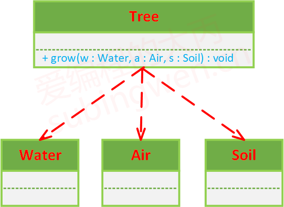


