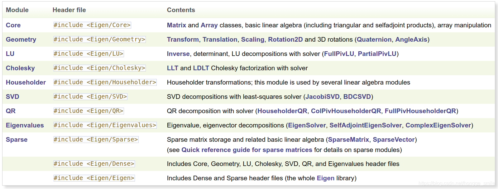

# Eigen
*Eigen是一个专注于线性代数、矩阵运算及数值算法的高层次C++开源库，核心功能涵盖固定/动态尺寸矩阵、稀疏矩阵操作、标准及自定义数值类型支持，并提供矩阵分解、几何特征求解等算法。该库仅依赖C++标准库，通过纯头文件实现跨平台兼容，支持CMake构建和模块化调用，广泛应用于计算机视觉、机器人、人工智能等领域。*<br>
>[*Eigen官方文档*](https://libeigen.gitlab.io/eigen/docs-nightly/)
>
>[*Eigen3中文教程*](https://www.windtunnel.cn/eigen3tutorial/)
## Eigen库包含的模块

使用时一般包含Dense即可<br>
```cxx
#include <Eigen/Dense>
```
## 矩阵
* ### 矩阵创建与初始化
  * 固定大小类型矩阵
    ```cxx
    // 矩阵
    Matrix<float, 3, 3>
    Matrix<double, 3, 3>
    // 方阵
    Matrix3d
    Matrix3f
    ```
  * 动态大小类型矩阵
    ```cxx
    // 动态大小矩阵
    MatrixXf
    MatrixXd
    ```
  * 特殊矩阵
    ```cxx
    // 对角矩阵
    DiagonalMatrix<T, Size>
    // 稀疏矩阵
    SparseMatrix<T>
    // 示例
    DiagonalMatrix<double, 3>
    DiagonalMatrix<double, Dynamic>
    SparseMatrix<double> sparse(1000,1000);
    ```
  * 矩阵初始化
    ```cxx
    // 零矩阵
    Matrix3d zero = Matrix3d::Zero();
    // 单位矩阵
    Matrix3d identity = Matrix3d::Identity();
    // 随机矩阵
    Matrix3d random = Matrix3d::Random();
    // 常数矩阵
    Matrix3d constant = Matrix3d::Constant(1.0);
    // 逗号初始化(矩阵阵列也可以初始化矩阵)
    Matrix3d m;
    m << 1, 2, 3,
        4, 5, 6,
        7, 8, 9;
    ```
* ### 元素访问
  * 访问/修改元素
    - 使用 () 运算符：matrix(i,j)，可读写
    - 使用 .coeff(i,j) 只读访问，.coeffRef(i,j)可修改访问。有边界检查更安全
    - 行列访问：.row(i), .col(j)
    ```cxx
    // ()访问
    matrix(0,0) = 1.0; 
    // .coeff()访问，只读
    double val = matrix.coeff(i,j); 
    // .coeffRef(访问)，可读写
    matrix.coeffRef(i,j) = 2.0; 
    // 获取第1行
    auto row = matrix.row(0); 
    // 获取第1列
    Vector3d col =matrix.col(1); 
    // 整行操作 
    matrix.row(0).array() += 1.0;
    ```
  * 矩阵块操作
    - 固定大小块：.block<p,q>(i,j)
    - 动态大小块：.block(i,j,p,q)
    - 行块：.row(i)
    - 列块：.col(j)
    ```cxx
    // 提取2x2块，起始于(1,1)
    Matrix4d m;
    auto block = m.block<2,2>(1,1);
    // 同样提取2x2块
    MatrixXd m(4,4);
    auto block = m.block(1,1,2,2);  
    // 头尾部和边角
    auto top_rows = m.topRows(2) // 前2行
    auto bottom_cols = m.bottomCols(2) // 后2行
    auto left_cols = m.leftCols(2) // 左2列
    auto topLeft = m.topLeftCorner(2,2); // 左上角
    auto bottomRight = m.bottomRightCorner(2,2); // 右下角
    ```
* ### 矩阵属性
  * 大小：.rows(), .cols(), .size(), .empty()
  * 最大/最小值：.maxCoeff(), .minCoeff()
  * 和、平均：.sum()，.mean()
  * 迹、行列式：.trace() .determinant()
  * 范数：.lpNorm<1>(), .norm()
  * 转置、逆：.tanspose(), .inverse()
  * 其它：.isZero(), .isOnes(), .isIdentity(), .isDiagonal()
  ```cxx
  // 带索引的最值查找
  Matrix3d m = Matrix3d::Random();
  Index max_row, max_col;
  double max_val = m.maxCoedd(&max_row, &max_col); // 返回最大值的同时返回索引位置
  ```
## 向量
* ### 向量创建和初始化
  ```cxx
  // 固定大小向量，()初始化
  Vector3d v1(1,2,3);
  // 动态大小初始化，逗号初始化
  VectorXd v2(5);
  v2 << 1,2,3,4,5;
  // 零向量
  Vector3d v3 = Vector::Zero();
  // 1向量
  Vector3d v4 = Vector::Ones();
  // 随机向量
  Vector3d v5 = Vector::Random();
  ```
* ### 向量访问
  ```cxx
  // []或()访问，()检查边界更安全
  double x = v1(0);
  double y = v1(1);
  // x y z访问，意义更明确
  double z = v1.z();
  // 获取前N/后N个元素
  auto head = v1.head(2);
  auto head = v1.tail(2);
  ```
* ### 向量运算
  * 基本运算
    - 加减：v1 + v2, v1 - v2
    - 乘除：2 * v1, v1 / 2
    - 点积：v1.dot(v2) 或 v1.transpose() * v2
    - 叉积：v1.cross(v2)
  * 范数 & 归一化
    ```cxx
    // L2范数
    double norm = v1.norm();
    // 范数的平方
    double squared_norm = v1.squaredNorm();
    // L1范数
    double norm_L1 = v1.lpNorm<1>();
    // 无穷范数(向量元素绝对值的最大值)
    double norm_inf = v1.lpNorm<>(Infinity);
    // 归一化:1 返回归一化后的向量
    Vector3d normalized = v1.normalized();
    // 原地归一化
    v1.normalize();
    ```
  * 其它操作
    ```cxx
    // 向量投影，v1在v2上的投影
    Vector3d proj = v2 * (v1.dot(v2) / v2.squaredNorm());
    // 使用旋转矩阵
    Matrix3d R = AngleAxisd(M_PI/4, Vector3d::UnitZ()).matrix();
    Vector3d rotated = R * v1;
    ```
## 几何变换
* ### 基本变换类型
  - 平移变换：Translation3d
    ```cxx
    // 平移初始化：用3维向量初始化或直接初始化（x-y-z分别平移1、2、3）
    Translation3d T(Vector3d(1,2,3));
    Translation3d T(1,2,3);
    ```
  - 旋转变换
    - AngleAxisd：轴角旋转（旋转向量）
      ```cxx
      // 轴角表示
      AngleAxisd R_angle_axis(15, Vector3d(1,2,3));
      // 转换成旋转矩阵
      Matrix3d R_mat = R_angle_axis.matrix();
      ```
    - Quaterniond：四元数旋转
      ```cxx
      // 四元数初始化
      // 直接指定四元数分量
      Quaterniond q1(w,x,y,z);
      // 通过旋转矩阵初始化
      Quaterniond q2(Matrix3d);
      // 通过轴角初始化
      Quaterniond q3(AngleAxisd);
      // 归一化（原地）
      q1.normaliize();
      // 转换为旋转矩阵
      Matrix3d m1 = q1.matrix();
      ```
    - Euler角
      ```cxx
      // 欧拉角创建旋转矩阵(Z-Y-X外旋)
      Matrix3d R = (AngleAxisd(yaw, Vector3d::UnitZ()) * AngleAxisd(pitch, Vector3d::UnitY()) * AngleAxisd(roll, Vector3d::UnitX())).matrix();
      // 旋转矩阵提取欧拉角，2=Z轴，1=Y轴，0=X轴
      Vector3d euler = R.eulerAngles(2, 1, 0); // Z-Y-X顺序
      // 旋转矩阵构造四元数
      Quaterniond q(R);
      // 旋转矩阵构造轴角
      AngleAxisd aa(R);
      ```
    
  - 缩放变换：Scaling (本质上是对角矩阵)
    ```cxx
    // 使用Vector3d初始化
    Scaling s1(Vector3d(2.0,2.0,2.0));
    // 使用标量初始化
    Scaling s2(2.0);
    // 转换成变换矩阵（对角矩阵）
    Matrix3d m1 = s1.toDenseMatrix();
    ```
* ### 组合变换类型
  - 仿射变换：Affine3d
    ```cxx
    /* Affine3d 本质是将所有的变换用4x4的齐次矩阵型式表达（3维空间）
    尺度变换                                旋转变换        平移变换
    | s_x*unit_x s_y*unit_y s_z*unit_z 0 | | r_x r_y r_z 0 | | unit_x unit_y unit_z t |
    | 0          0          0          1 | | 0   0   0   1 | | 0      0      0      1 |
    */
    // 由尺度变换+旋转+平移组成的仿射变换
    Affine3d transform = Translation3d(1, 2, 3) * AngleAxisd(M_PI / 2, Vector3d::UnitZ()) * Scaling(3.0,2.0,1.0);
    ```
  - 刚体变换：Isometry3d
    ```cxx
    // Isometry3d 齐次型式
    Isometry3d T = Isometry3d::Identity();
    T.rotate(q);
    T.pretranslate(Vector3d(1, 2, 3));
    ```
  - 投影变换：Projective3d
    ```cxx
    ```
