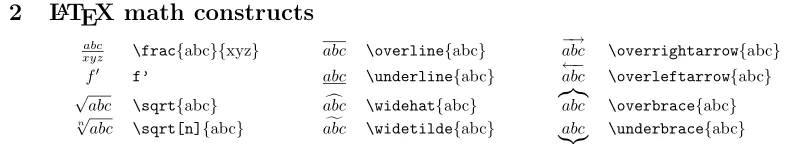
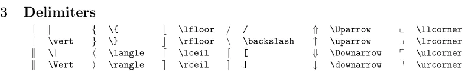

# LaTeX数学公式
## **基本语法结构**
* **$\lceil$行中公式$\rfloor$和$\lceil$独立公式$\rfloor$**<br>
  - 行中公式一般为单独行或嵌入在文本中，写法为<br>
    `$ 数学公式 $`  
    `上文 $a + b = c$ 下文`<br>
    显示为  
    上文 $a + b = c$ 下文
  - 独立公式一般为单独行或段，并以双斜杠\\\续行，写法为<br>
    `$$ 数学公式 $$` 
    ```
    $$
    x + y = 10 \\
    x - y = 6 \\
    2x = 16 \\
    x = 8 \\
    y = 2
    $$
    ```
    显示为
    $$
    x + y = 10 \\
    x - y = 6 \\
    2x = 16 \\
    x = 8 \\
    y = 2
    $$
* **基本表示方法**
  - **希腊字母&命令**：以反斜杠 \ 开头<br>
    ` \alpha \sum `  显示为：$\alpha$ $\sum$
  - **参数**：用花括号 { } 包围<br>
    `\frac{a}{b}`  显示为：$\frac{a}{b}$
  - **上下标**：上标 ^, 下标 _<br>
    `x_2  x^2`  显示为：$x^2$  $x_2$
  - **分组**：用花括号将多个字符组合<br>
    `x_{i+1}`  显示为：$x_{i+1}$
## **希腊字母**


## **运算符**
* **四则运算**
  - 加减 `x+y=z`  $x+y=z$
  - 正负号 `x \pm y`  $x \pm y$
  - 叉乘 `x \times y=z`  $x \times y=z$
  - 点乘 `x \cdot y=z`  $x \cdot y=z$
  - 星乘 `x \ast y=z`  $x \ast y=z$
  - 除法 `x \div y=z`  $x \div y=z$
  - 斜除 `x/y=z`  $x/y=z$
  - 分式1(fraction) `\frac{x+y}{a+b}`  $\frac{x+y}{a+b}$
  - 分式2 `{x+y} \over {a+b}`  ${x+y} \over {a+b}$
  - 绝对值 `|x+y|`  $|x+y|$
* **逻辑运算符**
  - 大于  `x>y` $x>y$
  - 大于等于  `x>=y` $x>=y$

## **数学结构**

$\frac{abc}{xyz}$  
$\overrightarrow{v}$
## **定界符**

*注：将定界符与\left和、right组合使用可以自动匹配内容高度，适合矩阵形式的书写*<br>
$[$ $x$ $y$ $z$ $]$
## **矩阵**  
*矩阵中的元素用&分割，双反斜杠\\\换行*<br>
$\left$[$ d d f f f g $]$\right$

