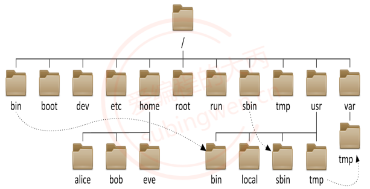
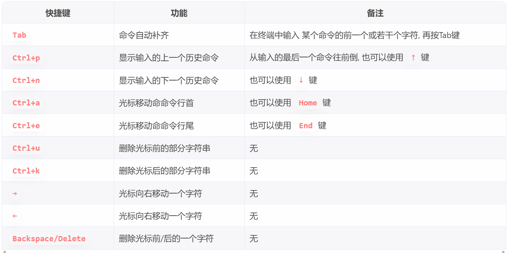

# Linux
## Linux目录结构

在linux中根目录的子目录结构相对是固定的(名字固定), 不同的目录功能是也是固定的
* bin: binary, 二进制文件目录, 存储了可执行程序, 今天要将的命令对应的可执行程序都在这个目录中
* sbin: super binary, root用户使用的一些二进制可执行程序
* etc: 配置文件目录, 系统的或者用户自己安装的应用程序的配置文件都存储在这个目录中
* lib: library, 存储了一些动态库和静态库，给系统或者安装的软件使用
* media: 挂载目录, 挂载外部设备，比如: 光驱, 扫描仪
* mnt: 临时挂载目录, 比如我们可以将U盘临时挂载到这个目录下
* proc: 内存使用的一个映射目录, 给操作系统使用的
* tmp: 临时目录, 存放临时数据, 重启电脑数据就被自动删除了
* boot: 存储了开机相关的设置
* home: 存储了普通用户的家目录，家目录名和用户名相同
* root: root用户的家目录
* dev: device，设备目录，Linux中一切皆文件, 所有的硬件会抽象成文件存储起来，如：键盘，鼠标
* lost+found: 一般时候是空的, 电脑异常关闭/崩溃时用来存储这些无家可归的文件, 用于用户系统恢复
* opt: 第三方软件的安装目录
* var: 存储了系统使用的一些经常会发生变化的文件， 比如：日志文件
* usr: unix system resource, 系统的资源目录
  * /usr/bin: 可执行的二进制应用程序
  * /usr/games: 游戏目录
  * /usr/include: 包含的标准头文件目录
  * /usr/local: 和opt目录作用相同, 安装第三方软件
## 命令行快捷键

