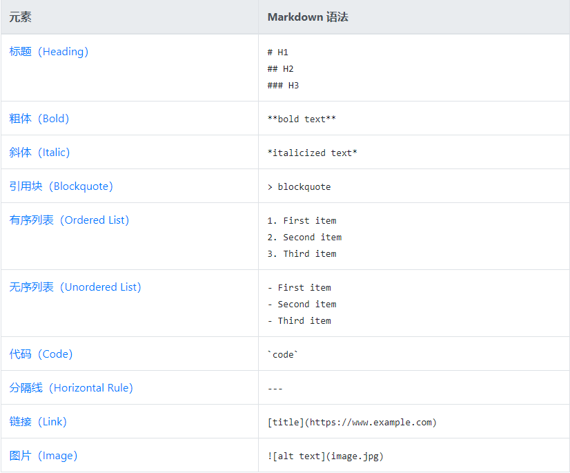

# Markdown语法
## 基本语法
  
* 修改图片显示的大小
  - 修改宽高 ``
  - 只修改宽，高自动等比例调整 ``
## 扩展语法
  
## 兼容HTML语法
* 文本居中 
  `
text</text>`
  
text</text>
* 换行 
  ` `
* 插入图片并缩放
  ``
## 参考资料
>[markdown指南中文版（超详细官方教程）](https://www.markdown.xyz/)
