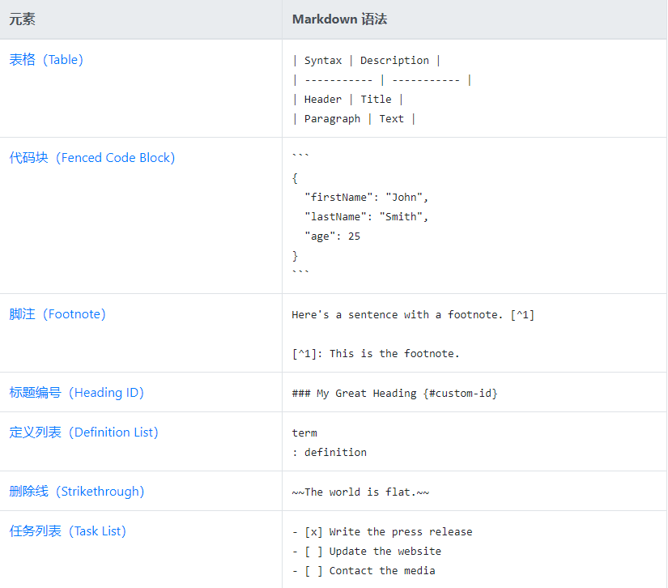

# Markdown语法
> [markdown指南中文版（超详细官方教程）](https://www.markdown.xyz/)
> 
> [有关在 GitHub 上编写的快速入门](https://docs.github.com/zh/get-started/writing-on-github/getting-started-with-writing-and-formatting-on-github/quickstart-for-writing-on-github)

> [!NOTE]
> 不同平台下markdown的部分语法可能不兼容
> 
## 基本语法
  

## 扩展语法
  
  * 表格对齐 `| :---        |    :----:   |          ---: |`

## 兼容HTML语法
* 文本居中 
  `<center>text</center>`或`<p align="center">text</p>`
  <p align="center">text</p>
* 换行 
  `<br>`
* 插入图片并缩放
  ``
* 下划线 `<ins>text</ins>`
  <ins>text</ins>
* 上标 `<sup>text</sup>`<sup>text</sup> 下标`<sub>text</sub>` <sub>text</sub>
* 颜色 `<font color="red">This text is red!</font>` <font color="red">This text is red!</font>
* 高亮 `I need to highlight these <mark>very important words</mark>.` I need to highlight these <mark>very important words</mark>.

## 警报
``` markdown
> [!NOTE]
> 注意
```
> [!NOTE]
> 注意
``` markdown
> [!TIP]
> 建议
```
> [!TIP]
> 建议
``` markdown
> [!IMPORTANT]
> 重要
```
> [!IMPORTANT]
> 重要
``` markdown
[!WARNING]
警告
```
> [!WARNING]
> 警告
``` markdown
[!CAUTION]
当心
```
> [!CAUTION]
> 当心
