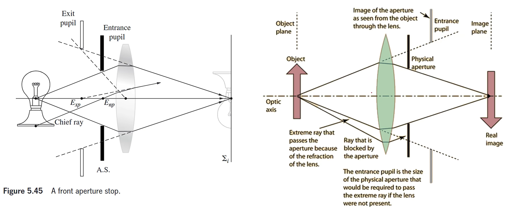
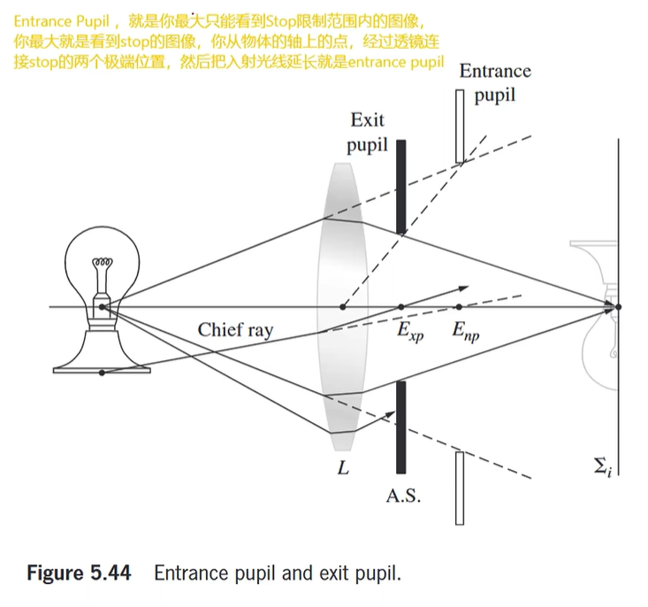

# 光学(Optics)

## 1. 基本概率
### 1.1 波面与波线(Wavefront & Wave Ray)
* **波面**：波面是指在空间中具有相同相位的点的集合。对于一个点光源发出的球面波，波面是一个以光源为中心的球面；对于一个平行光束，波面是一个平面。波面的形状和位置决定了光的传播方向和性质。（例如水面的波纹就是波面，每个波纹都具有相同的震动状态）
* **波线**：传播方向相同的光线集合称为波线。波线是垂直于波面的曲线，表示光的传播路径。对于一个点光源发出的球面波，波线是从光源向外辐射的直线；对于一个平行光束，波线是平行的直线。波线的密度表示光的强度，密度越大表示光越强。
<p align="center">

<br>
波面与波线
</p>

### 1.2 惠更斯原理(Huygens' Principle)
惠更斯原理指出，波前上的每一点都可以看作是次级球面波的波源，这些次级波的包络面构成了新的波前。这一原理可以用来解释光的反射、折射、衍射和干涉现象。
<p align="center">


<br>
惠更斯原理 & 波的反射与折射
</p>

## 2. 光阑（Stop）
### 2.1 光阑的作用
* Lens不能无限大，需要限制透镜宽度
* 提高成像质量，因为只有旁轴附近的光线成像质量较好
* 限制光通量，主要是对平行光的控制
* 
### 2.2 孔径光阑(Aperture Stop)
光学系统中限制通过光束直径的光阑称为孔径光阑，是所有成像光束的公共入口。对发光的物点来说，孔径光阑的大小限制了成像光束的立体角，也即限制了光通量。在摄影用相机镜头中，孔阑通常是一个尺寸可调整的光阑(Stop)，用于控制光通量.
<p align="center">

<br>
孔径光阑
</p>

### 2.3 入瞳(Entrance Pupil)与出瞳(Exit Pupil)
入瞳是物空间中孔径光阑的像，出瞳是像空间中孔径光阑的像。入瞳和出瞳的位置和大小决定了光学系统的光通量特性。
<p align="center">


<br>
孔径光阑与入瞳
</p>

### 2.4 主光线与入瞳(Entrance Pupil)
入瞳可以确定孔阑对成像光束的限制(上图)。入瞳的大小与孔阑的大小成正比，但其位置可能与孔阑不同。在摄影用相机镜头中，入瞳通常是一个虚像，可以通过调整光圈来改变其大小。<br>
设想将孔阑缩小使其变为一个小孔，直至只有过孔阑中心的光线可以通过系统成像，这样的光线称为主光线。主光线定义了一个物点发出的光束在成像过程中的传播方向，此外，主光线与各光学面的交点又与像差有着十分紧密的联系，对像差校正有着十分重要的意义。理想情况下，不同物点发出的主光线交汇于孔阑中心，因此，主光线（或其延长线）也一定交汇于入瞳中心。与主光线相对应，经过孔阑（入瞳）边缘的光线，称为边缘光线。
<p align="center">

<br>
主光线与入瞳
</p>

## 3. 几何光学
### 3.1 斯奈尔公式(Snell's Law)
* 斯奈尔公式描述了光在两种不同介质界面上的折射现象
  ```math
  n_1 \ast sin(\theta_2) = n_2 \ast sin(\theta_2)
  ```
  其中，n₁ 和 n₂ 分别是两种介质的折射率，θ₁ 是入射角，θ₂ 是折射角。
* **折射率**：光在不同材质下传播速度的衰减$n=\frac{c}{v}$，常见材料的折射率
  - 空气：约为 1.0003
  - 水：约为 1.33
  - 玻璃：约为 1.5 到 1.9（H-K9L折射率1.5168）
  - 
### 3.2 全反射
* **全反射临界角** 此时折射角为90°，入射角大于临界角后只有反射光无折射光
  ```math
  \theta=arcsin\frac{n2}{n1}
  ```
  <center>
  
  <br>
  全反射
  </center>
* 全反射镜（如直角棱镜）反射效率高于镀膜平面反射镜（反射效率约90%）
  


## 4. 光学现象
### 4.1 散斑(Speckle)
* 散斑是由于相干光（如激光）照射在粗糙表面或通过不均匀介质后产生的明暗斑点图案（常见于单色投影激光器）
* 形成机制：相干光在粗糙表面反射或通过不均匀介质时，不同路径的光波相互干涉，产生明暗变化
* 应用：散斑干涉测量、散斑成像、散斑相关技术等
* 简述：当相干光照射到粗糙表面时，表面的微小不规则结构会导致反射光的相位发生变化。不同位置反射回来的光波由于路径差异，在空间上产生干涉现象，形成明暗交替的散斑图案。这种现象在激光投影、激光显示等应用中尤为明显，可能影响图像质量。
<p align="center">

<br>
激光投影散斑现象
</p>  

### 4.2 干涉衍射(Interference & Diffraction)
#### 4.3.1 衍射(Diffraction)
* 衍射是波遇到障碍物或通过狭缝时发生的弯曲和扩散现象
* 形成机制：波在传播过程中遇到障碍物或狭缝
* 应用：光栅、衍射光学元件、光学测量等
* 简述：当波遇到障碍物或通过狭缝时，波前会发生弯曲和扩散，形成衍射图样。衍射现象在光学中尤为重要，影响光的传播和成像质量。在光学系统设计中，需要考虑衍射效应以优化性能。

#### 4.3.2 双缝干涉(Double-slit Interference)
> [!NOTE]
> 1. 两个波叠加后的强度为其**振幅项**。带时间的瞬态不能作为观察的光强度！
> 2. 判断相干条纹只需要看相位差（光程差），相位差相同则条纹相同
* 双缝干涉是指当相干光通过两条狭缝后，在屏幕上形成明暗相间的干涉条纹现象。波在通过狭缝后发生衍射，其在屏幕上各个位置的光程差不同。两个狭缝的衍射波在屏幕上同一位置由于存在光程差/相位差，波叠加后在屏幕上形成干涉条纹。
* 当光程差为波长的整数倍时，发生**建设性干涉**，形成亮纹；当光程差为波长的奇数倍时，发生**破坏性干涉**，形成暗纹。
* 相干光叠加的强度计算公式：
  ```math
  I=I_1+I_2+2\sqrt{I_1I_2}cos(\delta)
  ```
  其中，I₁ 和 I₂ 分别是两个波的强度，δ 是它们之间的相位差。
<p align="center">

<br>
双缝干涉
</p>  

#### 4.3.3 衍射光学元件DOE(Diffractive Optical Elements)
* 衍射光学元件（DOE）是一种利用光的衍射效应来控制和调制光波前的光学元件。DOE通过在其表面设计微小的结构，使入射光经过衍射后形成特定的光强分布或相位分布。
<p align="center">

<br>
DOE
</p>

