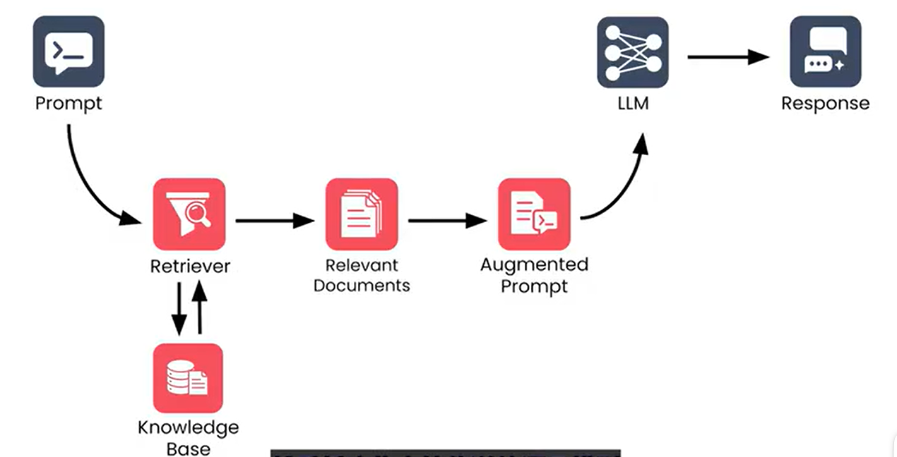
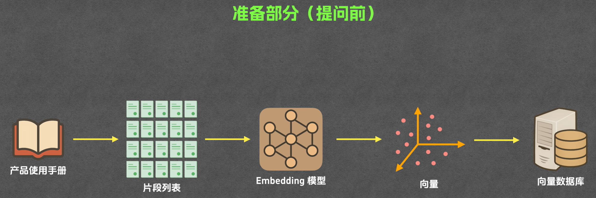
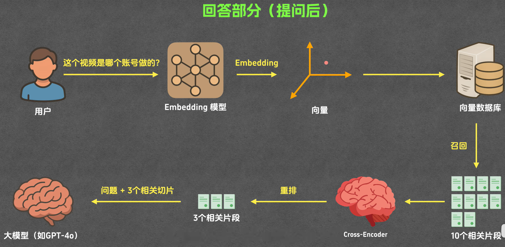
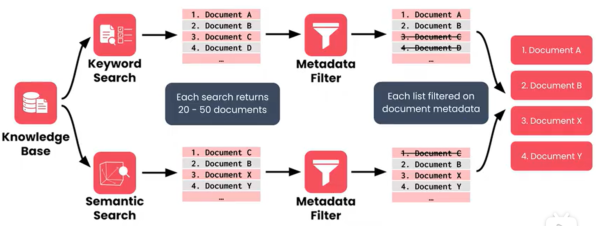

# RAG
> [RAG 工作机制详解——一个高质量知识库背后的技术全流程](https://www.bilibili.com/video/BV1JLN2z4EZQ/?spm_id_from=333.1387.homepage.video_card.click&vd_source=50f856c7eacb227ad5ea84420a6b423b)  
> [BiliBili GPT中英字幕 《检索增强生成|RAG》 吴恩达 coursera课程](https://www.bilibili.com/video/BV1Zg4dzTEdm?spm_id_from=333.788.videopod.episodes&vd_source=50f856c7eacb227ad5ea84420a6b423b&p=12)  

RAG(Retrieval-Augmented Generation) 检索-增强生成，是一种结合了信息检索技术与语言生成模型的人工智能技术。通过**从外部知识库中检索相关信息，并将其作为Prompt输入给LLMs，以增强模型处理知识密集型任务的能力**，如知识库、智能客服等。

 
RAG的流程

> [!NOTE]
> 与一般的LLM的问答不同的是，RAG将输入给LLM的提示词分为**用户问题/任务 **（用户输入）和**系统提示词**（限制词和其它模型生成的提示词），二者合并输入给LLM以提高其对某一类问题的命中率，并减少LLM幻觉（一本正经胡说八道）的概率。 系统提示词可以是：
> - 模型角色
> - 运行规则
> - 环境信息
> - ... 

> [!NOTE]
> **与Agent的区别**  
> Agent是使用LLM思考和推理（相当于大脑），再根据LLM思考的结果去调用相应的工具（相当于手脚）执行特定的任务。 

## 检索器（Retriever）
### 关键词检索（Keyword Search）
使用关键词匹配，可能会漏掉语义相近的关键词，一种传统方法（范围太小）。常用的关键词检索算法有：
  * TF-IDF(Term Frequency-Inverse Document Frequency, 词频-逆文件频率)
  * BM25(Best Matching 25) 
###  语义检索（Semantic Search）
根据语义检索相关内容，可能会检索到其它领域不相关内容（范围太大）
###  混合检索（Hybrid Search）
关键词检索和语义检索的结合

## 词向量（Embedding）
* 首先将知识库片段化(Chunking)，得到片段（Chunk），可以是按段落、按字数、按页数等
* 将Chunk向量化，以便于查找与用户问题相关的Chunk
* Embedding模型把Chunk向量化后，存入向量数据库（Vector Database，存储了向量和对应的Chunk原文）
* 相似度计算：欧式距离、余玄角度、点积（考虑距离和角度的结合）
* 
> [!WARNING]
> 词向量的分割和选取有一定的碎片化，这会导致上下文语义的缺失

## 重排序（Reranking）

## 工具
* [PandaWiki](https://pandawiki.docs.baizhi.cloud/)  
  AI 驱动的开源知识库搭建系统，帮助你快速构建智能化产品文档、技术文档、FAQ，提供智能问答，智能搜索，智能客服等能力。
  - 智能对话（Chat）、向量（Embedding）和重排序（Rerank）模型。推荐使用deepseek-chat作为对话模型，bge-m3作为向量模型，bge-reranker-v2-m3作为重排序模型

