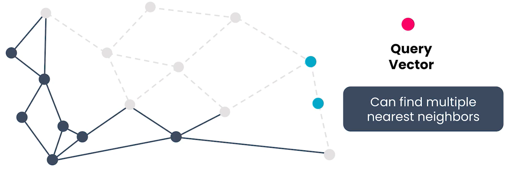
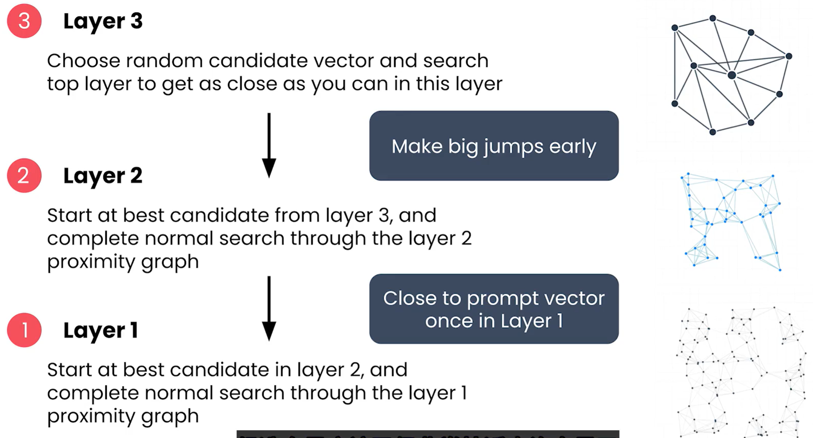

# RAG
> [RAG 工作机制详解——一个高质量知识库背后的技术全流程](https://www.bilibili.com/video/BV1JLN2z4EZQ/?spm_id_from=333.1387.homepage.video_card.click&vd_source=50f856c7eacb227ad5ea84420a6b423b)  
> [BiliBili GPT中英字幕 《检索增强生成|RAG》 吴恩达 coursera课程](https://www.bilibili.com/video/BV1Zg4dzTEdm?spm_id_from=333.788.videopod.episodes&vd_source=50f856c7eacb227ad5ea84420a6b423b&p=12)  
  
**RAG(Retrieval-Augmented Generation) 检索-增强生成**，是一种结合了信息检索技术与语言生成模型的人工智能技术。通过**从外部知识库中检索相关信息，并将其作为Prompt输入给LLMs，以增强模型处理知识密集型任务的能力**，如知识库、智能客服等。

<p align="center">


<br>
RAG的流程
</p>

> [!NOTE]
> 与一般的LLM的问答不同的是，RAG将输入给LLM的提示词分为**用户问题/任务 **（用户输入）和**系统提示词**（限制词和其它模型生成的提示词），二者合并输入给LLM以提高其对某一类问题的命中率，并减少LLM幻觉（一本正经胡说八道）的概率。 系统提示词可以是：
> - 模型角色
> - 运行规则
> - 环境信息
> - 其它 ... 

> [!WARNING]
> **与Agent的区别**  
> Agent是使用LLM思考和推理（相当于大脑），再根据LLM思考的结果以及观测结果去多轮调用相应的工具（相当于手脚）执行特定的任务。例如下图是OpenManus的核心流程图   
> <p align="center">
> 
> <br>OpenManus流程图
> </p>

## 1. 片段化（Chunking）
片段化是将大型文本或文档拆分成较 小的、易于管理和处理的部分（Chunk）。这些Chunk可以是段落、句子、固定字数的文本块，甚至是特定主题的内容块。片段化有助于提高信息检索和处理的效率，尤其是在使用RAG等技术时。Chunking的常用方法有
* Overlapping Chunking（重叠片段化）：每个Chunk之间有一定的重叠部分，以保留上下文信息，减少信息丢失。例如，每个Chunk包含500个字，并与前一个Chunk重叠50个字。
* Recursive Character Splitting（递归字符拆分）：根据特定的分隔符（如段落、句号、逗号、空格、HTML标签）递归地拆分文本，确保每个Chunk在语义上是完整的。
* Semantic Chunking（语义片段化）：根据文本的主题或语义内容进行拆分，将前后语义近似的段落合并成一个Chunk，确保每个Chunk在意义上是连贯的。（可以借助LLM离线完成）

### Query Rewriting（查询重写）
在某些情况下，用户的查询可能过于简短或模糊，导致检索器难以找到相关的Chunk。查询重写技术通过扩展或修改用户的查询，使其更具体和明确，从而提高检索的准确性。例如，将“气候变化”重写为“气候变化对全球生态系统的影响”。
* 清除废话，使问题更加精炼
* 修改或增加措辞，使用词更准确专业
* 通常直接使用LLM优化Query（一切皆可大模型）

> [!WARNING]
> 词向量的分割和选取有一定的碎片化，这会导致上下文语义的缺失（只有局部信息，缺乏全局和关联信息）

## 2. 检索器（Retriever）
检索器的作用是从知识库中找到与用户查询最相关的信息片段（Chunk），并将这些片段提供给LLM以辅助回答用户的问题。检索器通常需要在保证高召回率的同时，提高检索的准确率，以确保生成模型能够获得足够且相关的信息来生成高质量的回答。
### 2.1 关键词检索（Keyword Search）
关键词匹配的速度快，比较适合在线搜索（比如搜索Internet），但可能会漏掉语义相近的关键词（例如happy和glad），且多义词（例如python既可以表示编程语言，又可以表示蛇）也会干扰搜索，导致检索范围受限或不准确。常用的关键词检索算法有：
  * TF-IDF(Term Frequency-Inverse Document Frequency, 词频-逆文件频率)
  * BM25(Best Matching 25) 

### 2.2 语义检索（Semantic Search）
语义搜索需要大量计算资源，一般会预先将搜索内容片段化（Chunking）和向量化（Embedding），并存储到向量数据库（Vector Database），以加快搜索速度降低延迟。语义检索也可能会检索到其它领域不相关内容，导致检索范围过大。
* 知识库Chunking，得到片段（Chunk），Chunking可以按段落、字数、页数、文章等方式
* 将Chunk向量化，以便于查找与用户问题Chunk相关的知识库Chunk
* 使用Embedding模型把Chunk向量化后，存入Vector Database（存储了向量和对应的Chunk原文）
* 相似度计算：欧式距离(Euclidean Distance)、余弦角度(Cosine Similarity)、点积(Dot Product)（考虑距离和角度的结合）

> [!NOTE]
> **评估指标**
> - Accuracy 准确率（正确率）
> ```math 
> Accuracy=\frac{所有预测正确的样本}{总样本}=\frac{TP+TN}{TP+FN+FP+TN}
> ```
> - Precision 精确率（查准率）
> ```math 
> Precision=\frac{将正类的预测为正类}{预测的正类}=\frac{TP}{TP+FP}
> ```
> - Recall 召回率（查全率）
> ```math 
> Recall=\frac{将正类的预测为正类}{原本的正类}=\frac{TP}{TP+FN}
> ```
> - AP(Average Precision) 平均精度  
>   AP 是在不同的召回率阈值下计算的精度的平均值。通过绘制 Precision-Recall（P-R）曲线，计算出 P-R 曲线下的面积作为 AP 的值。简单来说，AP 是对模型在某一类别下的检测能力的衡量。AP 值越高，表示模型在不同召回率下的精度表现越好。
> - mAP(Mean Average Precision) 平均精度均值  
>   mAP 是在多个类别上的 AP 的平均值，用于衡量模型在整个数据集上的检测性能
>   ```math
>   mAP=\frac{1}{N}\sum^{N}_{i=1}AP_i
>   ```
>  ---
> - **例如**：假设共有100个Chunk，其中10个与Prompt是相关的，Retriever检索到12个结果，其中有8个是相关的（剩下4个不相关）  
>   **召回率（是否有遗漏）** $Recall = \frac{8}{10}$  
>   **精确率（是否正确）** $Precision = \frac{8}{12}$
> ---

### 2.3 混合检索（Hybrid Search）
关键词检索和语义检索的结合
<p align="center">

<br>混合检索
</p>

### 2.4 向量搜索（Vector Retrieval）
* **KNN**(K Nearest Neighbors)  K近邻搜索，搜索速度慢，全局最优
* **AN**N(Approximate Nearest Neighbors) 近似近邻搜索，利用图结构加速搜索，局部最优，可能会遗漏全局最优（梯度下降思想）
  <p align="center">
  
  <br> ANN
  </p>
* **HNSW**(Hierarchical Navigable Small World) 分层导航小世界图，基于图结构的近似最近邻搜索算法，兼顾速度和准确率（自适应梯度下降思想）
  <p align="center">
  
  <br> HNSW
  </p>

## 4. 重排序（Reranking）
Retriever检索速度快，一般能保证较高的召回率，但是准确率较低，将Retriever检索的Chunk再经过Reranking Model处理后，可以进一步排除不相关Chunk，提高精确率。

### Cross-Encoding（交叉编码）
交叉编码是一种通过同时考虑查询和候选Chunk之间的关系来评估其相关性的方法。与单独编码查询和Chunk不同，交叉编码将查询和Chunk作为输入的一部分，一起传递给模型，以捕捉它们之间的细微关系。这种方法通常使用双塔模型（Siamese Network）或Transformer架构来实现。

## 5. 常用工具（Tools）
### 5.1 向量数据库（Vector Database）
* Weaviate(开源)

### 5.2 嵌入模型（Embedding Model）
* OpenAI Embedding Models


